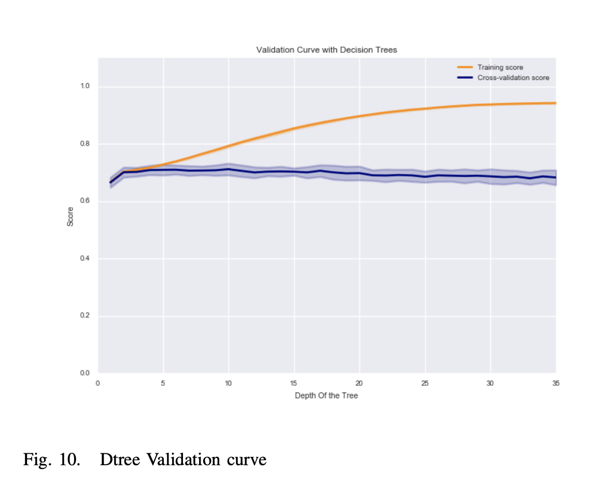

  

# Abstract
When a persons family member or loved ones meets with an accident, its unfortunate enough that they did, they also need to focus on aspects like insurance and other paper work along with their grievances. In this project, with the help of some machine learning algorithm, we will be predicting the cost and hence severity of the claims.
#  INTRODUCTION
Accidents happen every 60 seconds in the world. When you’ve been devastated by a serious car accident, your priority is on the things that matter the most: family, friends, and other loved ones. Pushing paper with your insurance agent is the last place you want your time or mental energy spent. Therefore, Allstate, a personal insurer in the United States, is continually seeking fresh ideas to improve their claims service for the over 16 million households they protect. In this project, we will create an algorithm which accurately predicts claims severity. We will try to demonstrate insights into better ways to predict claim severity, and be a part of Allstates efforts to ensure a worry-free customer experience. With the help of machine learning algorithms like K-Nearest Neighbors, Decision Trees, Logistic Regression, Naive Bayes, Bagging, and Boosting, we are trying to predict the claim severity. Furthermore, we will compute the average of the confusion matrix entries, accuracy, true positive rate, false positive rate, and the area under the ROC curve. Performance of the algorithms will be analyzed. We will speculate on why the one algorithm is better than the other and why they exhibit similar results.
# DATASET DESCRIPTION
The dataset is derived from the website: [Kaggle](https://www.kaggle.com/c/allstate-claims-severity/data). The goal of this dataset is to predict the cost associated with the insurer and/or the severity of the claim. It consists of 116 categorical features and 14 continuous features. There are 7000 data points in dataset. The training to test samples ratio is 75:25 The feature names or their properties are unknown. The last column is the loss is the target variable which we are trying to predict.

# DATA PRE-PROCESSING
The last column which is the target variable is continuous. To change it to binary value, we found the mean of the values and categorized all the data points less than the mean as 0 and all the data points greaater than the mean as 1.For the 14 continuous features, we used the K-means algorithm to discretize the values. K-means is an unsupervised learning algorithm which groups similar data. The number of groups is given by k. Elbow method is used to find the optimal value of k. In this method, we plot a graph with number of clusters on the x-axis and average distance to the centroid and look for an elbow in the graph. The point when the line starts to flatten out is the k. To minimize the effect of initial centroid on the k means, each feature is clustered with 20 different initial centriods, and the initial centroid with minimum sum of squared errors is chosen. Using the above concept, in the above graph i.e. Fig. 1 , continuous features 4,5,6,10,11 and 13 are grouped in 13 clusters and the continuous features 1,2,3,7,8,9,12, and 14 are grouped in 12 clusters.

  

Binarization technique is used on the 116 categorical features to transform the values into 1s and 0s. The target variable has continuous features. From this column, the mean of the values is found and any value which is less than this mean is categorized as 0 and greater than the mean value is assigned. As seen from Fig. 2, the dataset is almost perfectly balanced, with [3482 for class 0 and 3518 for class 1]. Hence, we
dont have to perform oversampling or downsampling. It also justifies using accuracy as a performance measure.

  

## 10-FOLD CROSS VALIDATION
Cross-validation is a technique to evaluate predictive models by partitioning the original sample into a training set to train the model, and a test set to evaluate it. In k-fold cross-validation, the original sample is randomly partitioned into k equal size subsamples. Of the k subsamples, a single subsample is retained as the validation data for testing the model, and the remaining k-1 subsamples are used as training data. The cross-validation process is then repeated k times (the folds), with each of the k subsamples used exactly once as the validation data. The k results from the folds can then be averaged (or otherwise combined) to produce a single estimation. The advantage of this method is that all observations are used for both training and validation, and each observation is used for validation exactly once.

# FEATURE SELECTION
## Chi-Square technique
I have performed feature selection on the dataset by applying two methods: Chi-Square test and forward selection. In the Chi-Square technique, we calculate the chi-square statistics between every feature variable and the target variable and observe the existence of a relationship between the variables and the target. If the target variable is independent of the feature variable, we discard that feature variable. If they are dependent, the feature variable is important and is kept for further analysis. A Chi-square test is designed to analyze categorical data. Forward Selection and 10 Fold Cross validation is used for Tuning k in k nearest neighbors.The steps are: Iteratively increasing the subset of features from top 100 (features are ranked using chi2 feature selection) to the top 800 features, for each subset, test the number of nearest neighbors in range of values from (10,17) using 10 fold cross validation. The Optimal number of K depends on the combination of (Number of top Features, Number of Nearest Neighbors) which gives the maximum cross validated accuracy.Fig. 3 shows the best 16 categorical features of the dataset.

  

We checked for missing values in the dataset, but found none.
## Forward selection
Forward selection is an iterative method in which we start with having no feature in the model. In each iteration, we keep adding the feature which best improves our model till an addition of a new variable does not improve the performance of the model.[6]

# Modelling
## K-Nearest Neighbors algorithm
K nearest neighbors is a lazy algorithm that stores the data points and classifies new data points based on distance functions(Euclidean in our case). A majority vote of its neighbors classifies a data point. The data point is assigned a class variable which its K-nearest neighbors have in common, measured by the distance function. If K is 1, then the data point is assigned to the class of its nearest neighbor.[8] Forward Selection and 10 Fold Cross validation is used for Tuning k in k nearest neighbors.The steps are: Iteratively increase the subset of features from top 100 (features are ranked using chi-square feature selection) to the top 800 features. For each subset, test the number of nearest neighbors in range of values from (10,17) using 10 fold cross validation. Optimal number of K depends on the combination of (Number of top Features, Number of Nearest Neighbors) giving the maximum cross validated accuracy. In the Fig 4, the graphs explain the cross validation accuracy for the combination of Number of subset of features and Number of nearest neighbors.

  

For instance, in the first subplot, we can see the cross validation accuracy of top 100 features selected through chi-square feature selection, and different value of nearest neighbors in the range of values from 10 to 15.The maximum observed accuracy values are for k 10 and 14. Similarly, in the second subplot with 200 features, the maximum accuracy values are for k are 13 and 15.
 - Bias Variance Analysis of the KNN model: Bias is theerror caused due to the difference between the expected prediction of our model and the correct value which we are trying to predict. Variance is measured by how the estimate of the target function will change if different training data is used. When we have a model with high bias, it underfits the data, and if we have a model with high variance and low bias,
it overfits the data. In K-NN small k causes variance, a big k causes Bias. The bias is low when choosing a small k because, we fit our model only to the small-nearest point. This means that our model will be close to the training data. When applied on a test set, the model changes drastically and hence doesn’t perform the same. Fig. 5 is the validation curve graph. It is plotted for different values of k. Values of both training accuracy and Cross validation Accuracy can be seen represented in it. If both the training and validation scores are low, the estimator will underfit. If the training score is high and the validation score is low, the estimator is overfitting. A low training score and a high validation score is usually not possible.As seen in the graph for small values of k, training score is high and validation score is low which explains the high variance and hence overfitting in the model. Overfitting can be reduced by bagging.

  

Fig. 6 shows the validation curve for bagged K-NN model.
Since we have already tuned the model, and found the value of optimal k to be 13 or 15.We have decided to go with k=13, since there is very less improvement in accuracy. Hence, this validation curve is plotted for K-NN with the value of k to be 13. The x - axis is the number of bags in the model. As seen from the graph there is an improvement in the validation score and the training score has reduced from 1 to 0.8 - 0.9 as the number of bags increases.This implies that the training accuracy has reduced and the model has been prevented from memorizing the data hence reducing overfitting.

  

2) Results: The accuracy is: 74.1714285714
The confusion matrix for the classifier:

  

  

The number of false positive: 117
The number of true positive: 517
The True Positive Rate: 0.606807511737
The False Positive Rate: 0.130289532294
The accuracy is: 74.8571428571

  

As we can see from the Fig. 7, Fig. 8 and the values, although there is not much improvement in the accuracy, the bagged model has a slightly better performance.
## Decision Tree
A decision tree or a classification tree is a tree in which each internal (non-leaf) node is labeled with an input feature.Each leaf of the tree is labeled with a class or a probability distribution over the classes.[4] A decision tree is built topdown from a root node and involves partitioning the data into subsets that contain instances with homogenous values.[7] ID3 algorithm uses entropy to calculate the homogeneity of a sample. If the sample is completely homogeneous the entropy is zero and if the sample is an equally divided it has entropy of one. Forward Selection and 10 Fold Cross validation is used for Tuning depth of the decision trees. Similar steps are followed for : Iteratively increase the subset of features from top 100 (features are ranked using chi-square feature selection) to the top 800 features. For each subset, test the various depths in the range 1-35 using 10 fold cross validation. Optimal depth depends on the combination of (Number of top Features, Depth of the tree) giving the maximum cross validated accuracy. In the Fig 8, the graphs explain the cross validation accuracy for the combination of Number of subset of features and the depth of the tree.From the graph, we observe that the accuracy is highest when 100 features are selected. One can also infer from the graph that as the depth increases, there is a steep decrease in the cross validated accuracy, which is a clear sign of overfitting.

  

To validate the above statement, we have plotted a curve which shows the cross-validation curve and the training curve. In the Fig. 9, We can observe that, as the depth increases the training accuracy increases but the cross validated decreases mildly. We deduce that, the model is overfitting and hence the performance degrades on unseen test examples. The combination for best cross validation accuracy is with the top 100 features and the depth of the tree is 7. In the validation curve(Fig. 8) the maximum cross validation accuracy is also for depth 7, which matches our tuning results. When the depth keeps increasing the training accuracy alone increases, hence we can see the model is overfitting. Previously, we saw that the optimal depth is 7, we also saw that the dataset has more variance with more depth and a steep increase in the training accuracy and minimal reduction in cross validation accuracy. We will carry out bagging to check
the performance.

  

As seen in Fig. 10, bagging has improved the performance of the model. The cross validation accuracy did not fall below 70 even with higher depths. Since bagging has improved the performance of the model using tuning set, we will implement it on the dataset. To check the effect of boosting on the dataset, let us plot the validation curve to determine whether to implement it on our dataset. We observe that as the number of boosting iterations increase, the training accuracy increases sharply, but the cross validation accuracy has a nominal decrease. Hence, implementing bagging on the data is our best bet.

  

bet.
1) Results: The accuracy is: 75.1428571429
The confusion matrix for the classifier:

  

## Naive Bayes Algorithm
Bernoulli NB implements the naive Bayes training and classification algorithms for data that is distributed according to multivariate Bernoulli distributions; i.e., there may be multiple features but each one is assumed to be a binary-valued (Boolean) variable. Therefore, this class requires samples to be represented as binary-valued feature vectors; [3] The decision rule for Bernoulli naive Bayes is based on
P(xi| y) = P(i | y)xi + (1 − P(i | y))(1 − xi) (1) 
The Bernoulli Naive Byes is useful if the feature vectors needs to be in Binary form as against the multinomial Naive Bayes and 10 Fold Cross validation is used for Tuning Alpha. Similar steps are followed: Iteratively increase the subset of features from top 100 (features are ranked using chi-square feature selection) to the top 800 features. For each subset, check the value of smoothing for the model. If the value of Alpha is 0, No smoothing is required. If the value of Alpha is 1, Laplace smoothing needs to be performed.

  

From the above figure, it can be observed that the best parameter is: top 500 features and alpha = 1 (i.e with Laplace Smoothing)
1) Results: The accuracy is: 73.4857142857
The confusion matrix for the classifier:

  

## Logistic Regression
In logistic regression we use a different hypothesis class to try to predict the probability that a given example belongs to the 1 class versus the probability that it belongs to the 0 class. [2]
Regularization works by adding the penalty associated with the coefficient values to the error of the hypothesis. This way, an accurate hypothesis with unlikely coefficients would be penalized whila a somewhat less accurate but more conservative hypothesis with low coefficients would not be penalized as much. We are applying the L2 regularization. L2 regularized logistic Regression requires sample size that grows linearly in number of irrelevant features. In regularization problems, the goal is to minimize the cost function with respect to θ. The regularization parameter λ is a control on the fitting parameters. As the magnitudes of the fitting parameters increases, there will be an increasing penalty on the cost function. [5] We are tuning the parameter C. We can clearly observe from Fig. 16 that as the value of C increases there is a mild decrease in the cross validation accuracy.

  

Results: The accuracy is: 75.8285714286
The confusion matrix for the classifier:

  

## Voting Classifier
Voting Classifier combines different machine learning classifiers and uses a weighted majority vote rule.
1) Results: The accuracy is: 76 The confusion matrix for
the classifier: The confusion matrix for the classifier:

  

Among the classifiers which have been implemented, Logistic Regression has the best accuracy of 75.83, followed by Bagged Decision Trees with accuracy of 75.14 and Bagged K-nearest neighbors of accuracy 74.86 and lastly of the Naive bayes classifier with accuracy of 73.48. The inclination is towards linear classifiers. Lets take a look at another Linear Classifier.

  

A. Linear SVM and other non-linear SVM
As seen from Fig 19, the accuracy of the Linear SVM is almost equal to the accuracy of Logistic Regression. In the case of Non-Linear SVM, the accuracy decreases drastically. In the case of sigmoid and polynomial kernel the accuracy is lesser than a random classifier i.e. 50%. Hence, we can speculate that the reason for higher accuracy of Logistic Regression to be linearity of the data, i.e the data is almost linearly separable.

B. Decision tree and Logistic Regression
Decision tree model was exhibiting a sharp decrease in the accuracy as the depth of the tree was increased, resulting in overfitting. The impact was almost cancelled out by applying bagging to the Decision Trees model, which resulted in the reduction of variance with an accuracy of 75.14. The Logistic Regression being a linear model, has high bias and low variance, resulted in a better accuracy than any other model. The comparatively lower accuracy of Naive Bayes classifier of 73.48 might be due to the assumption which states that features are independent of one another.

  

C. K-Nearest Neighbors
K-nearest neighbors, based on Euclidean distance, as expected suffers from the curse of dimensionality as the subset of features is increased beyond 400. It is explained in the previous graph, where the accuracy drops drastically from 74 to less than 67. This is because, as the dimension increases the distance becomes less representative. As we already stated, the maximum cross validation accuracy was achieved from the top
100 features. In the correlation plot below(Fig. 20), the top 25 features among the best 300 features used for training and predicting the naive bayes model has been plotted given the class label. We can clearly see that the features are not independent. Some of the features for instance, features ’cat80 B’ and ’cat79 D’
have a high correlation of 0.62. Hence the speculation of the violation of Naive Bayes assumption could be attributed to the defeat of Naive Bayes classifier. Understandably, the voting classifier produces the maximum accuracy as the maximum weight is given to the best model Logistic Regression.

  

# BAGGING MODEL OF TREES NEGATING FEATURE ENGINEERING
Without applying feature selection methods, we implemented the bagged model of decision trees to check the
accuracy.
Results
The accuracy of the classifier is: 72.5714285714
The confusion matrix for the classifier:

  

# CONCLUSIONS AND INFERENCES
The model was developed to predict the range of loss, incurred by the insurance provider based on 116 categorical features and 14 continuous features. Among the four individual models used, Logistic Regression produced the best accuracy. The usage of tuning set, improved the performance in all the four models.
## Key Inferences:
1) Linear classifiers like Logistic Regression and Linear SVM performed the best, whereas non linear classifiers produced accuracy less than a random classifier.
2) Overfitting in the decision trees and K - nearest neighbors was handled by the bagging model which provided a good increase in performance.
3) The effect of feature engineering was not substantial, as the scope of feature engineering was limited because of the encoded features. The performance of the model can be effectively improved by analyzing the features in depth. The data being a real world data and features being encoded, the accuracy of the model can be stated at par. Advanced algorithms like Deep Neural Networks should offer a scope of improvement.

## REFERENCES
[1] 10-fold crossvalidation. web page.
[2] Logistic regression. web page.
[3] Naive bayes. web page.
[4] Decision tree learning. web page, October 2016.
[5] Aleks Jakulin. What is the difference between l1 and l2 regularization?
web page, Sep 2013.
[6] SAURAV KAUSHIK. Introduction to feature selection methods with an
example (or how to select the right variables?). web page, Dec 2016.
[7] Dr. Saed Sayad. Decision tree - classification. web page, 2016.
[8] Dr. Saed Sayad. K nearest neighbors - classification. web page, 2016.

